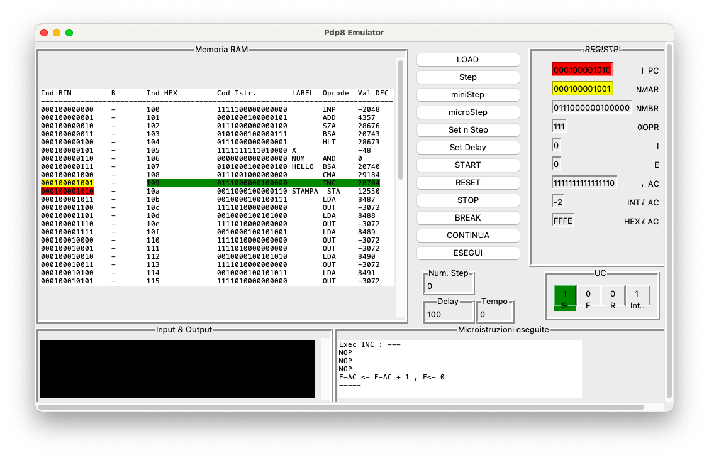

# py-pdp8-tk

A simple **pdp8** emulator oriented to teaching, thus with several simplifications (e.g. the I/O) and with an editor focused on processor inspection.

> **Note**: Currently, the GUI is in the Italian language only, translations and suggestions for a multilanguage interface are well accepted:grey_exclamation: Make a pull request:grey_exclamation:

## :clipboard: Requirements

* Python 3
* Tkinter

> **Note**: there is a revised version of the emulator in [branch pdp8-wxPython](https://github.com/MircoT/py-pdp8-tk/tree/pdp8-wxpython) that uses **wxPython** as GUI.

## :information_source: Info

Information about the **pdp8** specs and some examples can be found in the [wiki](https://github.com/MircoT/py-pdp8-tk/wiki).
